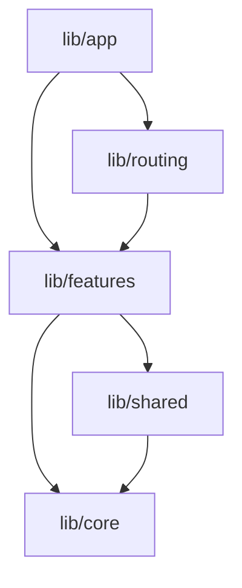

# High-Level Architecture - Forkumentos

This document describes the high-level architecture guidelines for the **Forkumentos** project.

## Core Design Principles

1. **Feature-First Organization**: The project is organized by feature rather than layer. Each feature inside `lib/features/` is self-contained and encapsulates its own domain, business logic, state, and UI files.
2. **Clean Separation of Concerns**: 
   - Global concerns (startup, global configuration) live in `lib/app/`.
   - Reusable domain-independent logic (commands, network/file services, global theme, error definitions, low-level utils) lives in `lib/core/`.
   - UI widgets, dialogs, enums, models, and providers shared between multiple features live in `lib/shared/`.
3. **Unidirectional Dependency Flow**:
   - Features can depend on `core` and `shared`.
   - Features must not import from other features directly; cross-feature communication must go through `shared` or via the routing layer.
   - `core` and `shared` must never depend on any feature.

## State Management Architecture
- State management is built on **Riverpod**.
- Business logic is encapsulated in Providers (`Notifier` and `AsyncNotifier`).
- The UI layer (Widgets) watches providers and displays state reactively.
