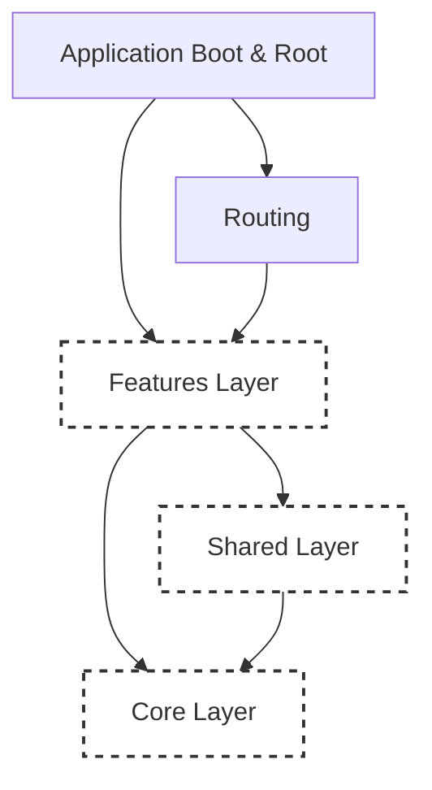
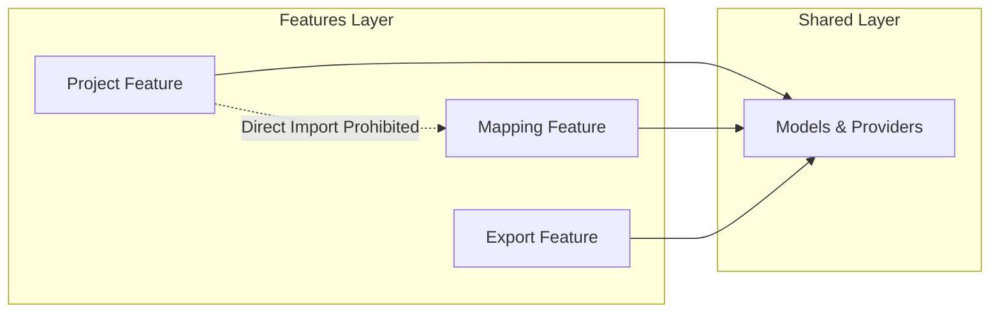
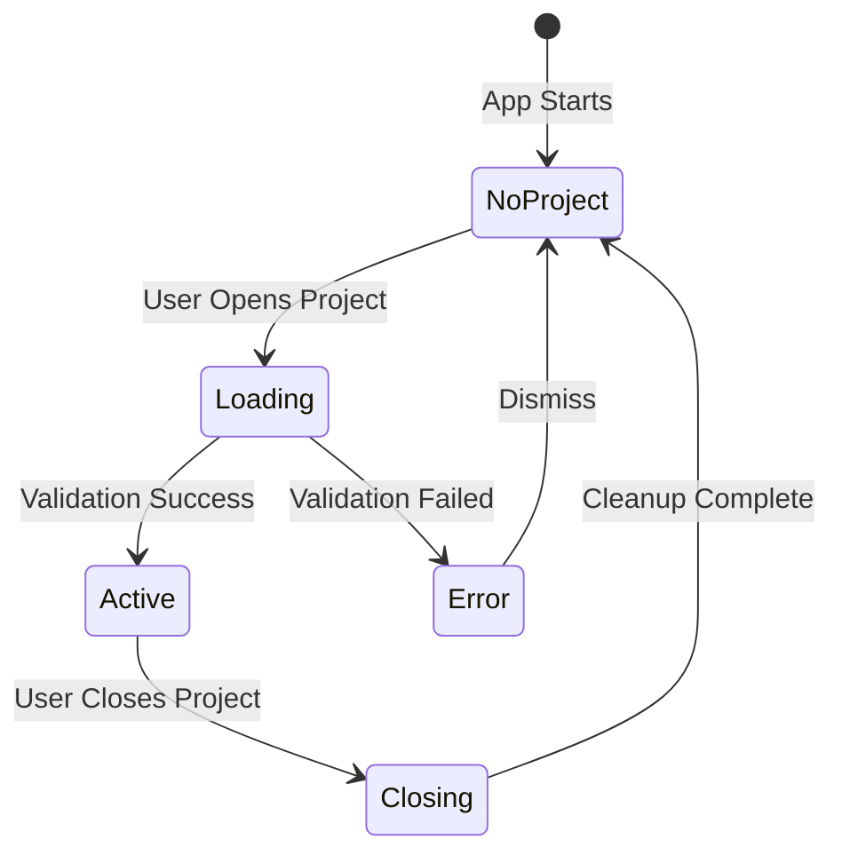

# Software Architecture: Forkumentos

This document defines the structural architecture, design patterns, and engineering strategies for the Forkumentos Desktop application. It dictates **how** the application is built.

---

## 1. System Architecture

Forkumentos is built upon a Clean Architecture-inspired foundation tailored for a modern Flutter desktop environment. The system strictly separates concerns into discrete domains, enforcing unidirectional data flow and isolating business logic from UI and infrastructure.



---

## 2. Feature-First Philosophy

The repository follows a **Feature-First** structure. Code is organized by business capability (e.g., `mapping`, `export`, `project`) rather than technical role (e.g., `controllers`, `views`, `models`).

- **Cohesion:** Code that changes together lives together.
- **Cognitive Load:** Developers only need to navigate a single feature directory to understand a specific capability.
- **Scalability:** Features can be added, modified, or removed atomically.

---

## 3. Dependency Direction

Dependencies flow strictly downwards. Circular dependencies and upward dependencies are prohibited by architectural boundaries.

1. `app/` depends on everything.
2. `routing/` depends on `features/`.
3. `features/` depend on `shared/` and `core/`.
4. `shared/` depends on `core/`.
5. `core/` depends on nothing (only external packages and Dart SDK).

**Lateral Dependency Ban:** Features cannot import other features directly.



---

## 4. Folder Responsibilities

The root `lib/` directory enforces the following layout:

```text
lib/
├── app/          # Application root widget and initialization routines
├── core/         # Domain-agnostic infrastructure, utilities, and services
├── features/     # Isolated business domains (the bulk of the app)
├── routing/      # Centralized navigation configuration and route guards
└── shared/       # Cross-feature UI components, models, and providers
```

---

## 5. Module Boundaries

Every feature inside `lib/features/` acts as an isolated module containing three lightweight layers:

1. **`domain/`**: Pure business logic, models, and repository interfaces. No Flutter imports.
2. **`data/`**: Repository implementations, DTOs, and local data sources.
3. **`presentation/`**: UI widgets, state notifiers, and Riverpod providers specific to this feature.

---

## 6. Shared Layer

The `shared/` directory bridges features without coupling them.
- Contains UI components utilized by multiple features (e.g., generic dialogs, standard buttons).
- Contains global models (e.g., `UserPreferences`).
- Contains shared state providers (e.g., the currently active project) that multiple features must react to.

**Documented Exception:** `shared/providers/active_project_provider.dart` may depend on the `Project` domain model and `ProjectRepository` from `features/project/domain` and `features/project/data`. This is the single, narrow exception to the "`shared/` depends on `core/` only" rule, justified because exactly one active project must be coordinated globally across features. No other `shared/` provider may depend on a feature.

---

## 7. Core Layer

The `core/` directory is the application's engine room. It contains infrastructure that has zero knowledge of the business domain.
- `commands/`: Base classes for the Command Pattern.
- `errors/`: Custom app exceptions and failure classes.
- `services/`: Low-level system integrations (file system, OS processes).
- `utils/`: Pure algorithms and extensions.

---

## 8. Application Bootstrap

Startup logic is isolated from the Flutter widget tree.
- A `bootstrap()` function in `lib/app/bootstrap.dart` handles pre-run requirements (e.g., configuring window size, initializing local storage, setting up logging).
- The Flutter `runApp()` is only called once the environment is stable and ready.

---

## 9. Routing

Navigation is centralized in `lib/routing/` using `go_router`.
- Routes are defined declaratively.
- Route guards intercept navigation (e.g., preventing navigation away from an unsaved project without confirmation).
- Features expose entry-point widgets, but do not dictate their own routes.

The root shell (`AppShell`) switches between three mutually exclusive **UI phases** (not domain states):
- **Landing** — no active project; create / open / recent only.
- **Project Wizard** — active project before the user starts working; template and datasource setup.
- **Workbench** — ribbon, document viewer, inspector, and status bar; entered only via “Start Working”.

Closing a project destroys the Workbench tree and returns to Landing. The Workbench chrome must never be instantiated in Landing or Wizard.

---

## 10. State Management Philosophy

**Riverpod** is the backbone of state management and dependency injection.
- **Notifiers:** Business logic is encapsulated in `Notifier` and `AsyncNotifier` classes.
- **Reactivity:** UI widgets (`ConsumerWidget`) pattern-match state and rebuild reactively.
- **Side Effects:** Mutations are handled asynchronously within notifiers, keeping UI code purely declarative.

---

## 11. Command Pattern

Complex, multi-step operations (e.g., document exports, batch mappings) use the **Command Pattern** located in `core/commands/`.
- Operations are encapsulated as objects (`ExportCommand`).
- This allows operations to be queued, cancelled, tracked for progress, and logged efficiently without cluttering state notifiers.

---

## 12. Persistence Strategy

Persistence is handled in two layers:
1. **Low-Level (`core/storage`)**: Wrappers around SQLite or key-value stores.
2. **Repository Layer (`features/*/data`)**: Reads and writes strongly-typed entities.

Feature state mutations often trigger asynchronous saves to ensure robust autosave functionality.

---

## 13. Logging

A centralized logging service in `core/logging/` captures events, errors, and system states. 
- UI components do not print directly to the console.
- Loggers categorize messages by severity and module for easier debugging.

---

## 14. Error Handling

- Errors are caught at the boundary (e.g., data source) and mapped to custom `Failure` objects (`core/errors/`).
- The UI never receives raw exceptions (like `FileSystemException`).
- Notifiers yield states representing failures, which the UI pattern-matches to display localized, actionable error messages.

---

## 15. Dependency Injection

Forkumentos relies entirely on **Riverpod Providers** for Dependency Injection.
- Services, repositories, and use cases are exposed globally via providers.
- During testing, these providers are overridden in the `ProviderScope`, allowing clean injection of mock or fake implementations without service locators.

---

## 16. Theme

Theming is centralized in `core/theme/`.
- Uses Material 3 design tokens.
- Defines specific typography, color palettes, and component themes tailored for a desktop workbench environment.

---

## 17. Window Management

Desktop-specific window configurations are applied during bootstrap using packages like `window_manager`.
- Sets minimum window dimensions to prevent layout breaks.
- Remembers and restores previous window positions and sizes on startup.

---

## 18. Project Lifecycle

The application operates on the strict rule of a single active project.



UI phases (Landing / Wizard / Workbench) sit on top of this lifecycle. `NoProject` maps to Landing; `Active` maps to Wizard until the user enters the Workbench, then to Workbench until close.

---

## 19. Background Processing

To maintain a smooth 60fps desktop UI:
- Heavy file parsing (e.g., large CSVs) and batch processing are offloaded to background isolates using `compute()`.
- Main thread operations are strictly reserved for UI rendering and lightweight state transitions.

---

## 20. Performance Strategy

- **Lazy Rendering:** Large tabular datasets (mapping previews) use virtualized lists (`ListView.builder` or specialized table widgets) to render only visible elements.
- **Derived State:** Expensive computed states (e.g., filtered lists) are cached using Riverpod derived providers rather than recomputed on every `build()`.

---

## 21. Testing Strategy

Testing boundaries are strictly defined:
- **Core:** Pure unit tests (no mocks needed).
- **Domain/Data (Features):** Unit tests with fake or mock repositories. No Flutter SDK imports.
- **Presentation (Features):** Widget tests using `ProviderScope` overrides to inject fake states.
- **Integration:** High-level user flows testing the interaction between multiple features.

---

## 22. Future Extensibility

The architecture is designed for seamless scaling:
- Adding a new export format requires only creating a new `Command` subclass.
- Adding a new data source format requires only implementing a new repository interface in the data layer.
- Shared models and providers ensure that new features can cleanly plug into the existing project lifecycle without modifying core application logic.
