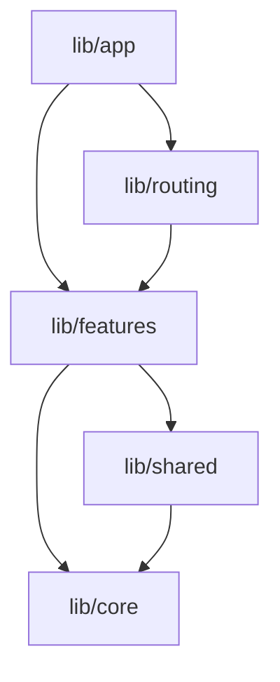

# High-Level Architecture — Forkumentos

This document describes the high-level architecture guidelines, structural principles, and patterns enforced in the **Forkumentos** Windows Desktop application.

---

## 1. Core Architectural Style: Feature-First

Forkumentos is built using a **Feature-First** structure. Instead of separating code by technical layers (e.g., placing all controllers in one folder, all UI in another), files are grouped by business capabilities (features). 

This design:
- Enhases **cohesion**: Code that changes together is placed together.
- Reduces **cognitive load**: Developers working on a single feature do not need to navigate across the entire project.
- Improves **scalability**: Adding or removing features is atomic and clean.

---

## 2. Folder Responsibilities

The root of the `lib/` directory is split into the following scopes:

### `lib/app/`
Contains global, application-wide configuration and startup files.
- `bootstrap.dart`: Isolate the startup/initialization flow (e.g., local database setup, window manager configs) from the Flutter widget tree.
- `app.dart`: The root widget (`App`), which initializes theme, routing, and Riverpod `ProviderScope`.

### `lib/core/`
The domain-independent foundation of the application. It contains infrastructure classes, utilities, and helper methods. Core **never** imports from features or shared.
- `commands/`: Base classes and executors for the Command Pattern.
- `constants/`: Shared compile-time constants (e.g., file extensions, limits).
- `errors/`: Custom app exceptions and failure classes.
- `extensions/`: Dart extension methods to expand SDK functionality.
- `logging/`: Log writers, filters, and logger configurations.
- `services/`: Low-level system integrations (e.g., local file system, process execution).
- `storage/`: Low-level key-value and SQLite handlers.
- `theme/`: Theme tokens, colors, and typography styles.
- `utils/`: Common functions and pure algorithms.

### `lib/features/`
Encapsulates individual business features of the project (e.g., `project/`, `template/`, `datasource/`, `mapping/`, `settings/`). 
Each feature is structured internally with light-weight layers:
- `data/`: Local datasources, repositories implementations, and DTOs.
- `domain/`: Business entities, repository interfaces, and pure domain logic.
- `presentation/`: Riverpod state controllers and widgets.
  - Sub-features are nested under the presentation layer (e.g., `mapping/presentation/review/` and `mapping/presentation/preview/`).

### `lib/shared/`
Contains reusable UI widgets, dialogs, enums, models, and providers that are utilized by two or more features. Shared code should only import from `core`.
- `animations/`: Shared transitions, curves, and animations.
- `dialogs/`: Common confirmation, alert, and form dialogs.
- `enums/`: Common enum classes (e.g., loading states).
- `layouts/`: Responsive grid and window layout structures.
- `mixins/`: Shared Dart mixins.
- `models/`: Immutable domain models shared app-wide.
- `providers/`: Shared state providers.
- `widgets/`: Reusable stateless/stateful widgets.

### `lib/routing/`
Centralizes navigation, route guards, and path definitions using `go_router`.

---

## 3. Dependency Direction Rules

- **Strict Downward Flow**: `app` -> `routing` -> `features` -> `shared` -> `core`.
- **Zero Lateral Imports**: A feature inside `lib/features/` must not import code from another feature directory directly. Lateral communication must be routed via `routing` or unified through models and providers inside `lib/shared/`.
- **Core Independence**: `core` must be completely independent. It should have zero dependencies on other directories inside `lib/`.

---

## 4. State Management Philosophy

We use **Riverpod (v2+)** to manage application state.
- **Notifiers**: Business logic is separated from widgets using `Notifier` and `AsyncNotifier` (using code generation).
- **Widgets**: Widgets inherit from `ConsumerWidget` or `ConsumerStatefulWidget` to watch changes.
- **Side Effects**: Side effects and mutation triggers are decoupled from the UI and encapsulated in asynchronous Riverpod methods.

---

## 5. Command Pattern (`core/commands`)

For complex operations (such as document mappings, exports, or project savings), we employ the **Command Pattern**:
- Operations are represented as object instances of a command class (inheriting from a base command in `core/commands/`).
- Allows operations to be easily queued, tracked, logged, or reversed (Undo/Redo) in the future.
- Isolates complex execution paths from state notifiers.

---

## 6. Persistence Strategy

Persistence is handled in two layers:
1. **Low-Level Storage (`core/storage`)**: Encapsulates raw file writes, SQLite db wrappers, and key-value preference storage.
2. **Repository Layer (`features/*/data`)**: Reads/writes model entities. Feature states automatically trigger saves on mutations to guarantee autosave functionality.

---

## 7. Dependency Injection (DI) Strategy

Rather than using service locators (like `get_it`), Forkumentos uses **Riverpod Providers** for dependency injection:
- Low-level services and repositories are defined as global providers.
- Mocking or overriding dependencies during tests is achieved cleanly by overriding providers inside the `ProviderScope` configuration.

---

## 8. Error Handling Strategy

Errors must be caught at the boundary (e.g., service or data source level) and mapped to custom `Failure` objects (defined in `core/errors/`).
- The UI must never receive raw platform exceptions (e.g., `FileSystemException`).
- Notifiers catch errors and yield states representing failure, which are then pattern-matched in the UI using standard Material snackbars or dialogs.
