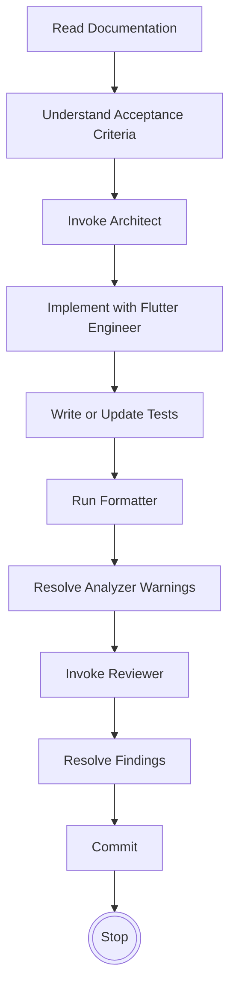

# Cursor Execution Guide: Forkumentos

## 1. Mission
The architecture and product design of Forkumentos are fully established. 
**Cursor is an implementation agent.** 
- Cursor is **NOT** responsible for product design.
- Cursor is **NOT** responsible for architecture design.
- Cursor's sole responsibility is implementing approved specifications exactly as written.

## 2. Documentation Authority
The operational contract between the project and Cursor is governed by a strict hierarchy of authority. Lower-priority documents can **never** contradict higher-priority documents.

1. `PROJECT_SPEC.md` (Product intent and scope)
2. `ARCHITECTURE.md` (System structure and boundaries)
3. `DESIGN_SYSTEM.md` (Visual language and UI heuristics)
4. `ENGINEERING_PLAYBOOK.md` (Development workflows)
5. `Cursor Rules` (`.cursor/rules/*.mdc`)
6. `Sprint Prompt` (The current active task)

## 3. Documentation Reading Strategy
- **Targeted Reading:** Cursor must **NEVER** load every document into context at once.
- Read only the specific sections required by the current sprint.
- **Literal Interpretation:** Never summarize or reinterpret documentation. Implement instructions exactly as written.

## 4. Execution Workflow
Every sprint must strictly follow this execution order:

## 5. Subagent Responsibilities
The main agent coordinates execution and delegates to the following specialized subroles (or subagents) at the designated steps:

| Subagent / Role | Invocation Trigger | Responsibility |
| :--- | :--- | :--- |
| **Architect** | Before writing any code | Validates that the proposed implementation satisfies `ARCHITECTURE.md` boundaries and avoids speculative abstractions. |
| **Flutter Engineer** | During implementation | Writes the actual Dart/Flutter code according to `Cursor Rules` and `DESIGN_SYSTEM.md`, ensuring simplicity and reusability. |
| **Reviewer** | Before finalizing the sprint | Conducts a strict review against the Completion Checklist. Verifies test coverage, linter status, and boundary enforcement. |

## 6. Question Policy
Cursor must **NEVER** ask questions already answered by existing documentation.

Before asking a question, follow this search cascade:
1. Search `PROJECT_SPEC.md`
2. Search `ARCHITECTURE.md`
3. Search `DESIGN_SYSTEM.md`
4. Search `ENGINEERING_PLAYBOOK.md`

If the answer exists: **Implement it. Never ask again.**

Questions are **only** permitted if:
- Documentation sources explicitly contradict each other.
- Strict technical limitations prevent implementation as specified.
- Resolving an ambiguity would irrevocably alter expected product behavior.

## 7. Decision Policy
When multiple valid implementation paths exist, rely on the following resolution hierarchies.

**Resolution Hierarchy:**
1. Follow `PROJECT_SPEC.md`
2. Follow `ARCHITECTURE.md`
3. Follow `DESIGN_SYSTEM.md`
4. Follow `Cursor Rules`
5. Apply Engineering Judgment

**Preference Hierarchy (Engineering Judgment):**
1. **Correctness:** Does it satisfy the specification without edge cases?
2. **Maintainability:** Will another agent easily understand this code tomorrow?
3. **Simplicity:** Is this the most direct path to the solution?
4. **Performance:** Does it meet the constraints without blocking the UI?
5. **Elegance:** Is the solution well-composed?

## 8. Scope Policy
- Implement **ONLY** the current sprint.
- **NEVER** implement future functionality or placeholder scaffolding.
- **NEVER** redesign approved workflows.
- **NEVER** modify unrelated modules or files outside the sprint's domain.
- Prefer the smallest correct implementation.

## 9. TDD Policy
Forkumentos strictly follows **Specification Driven Development + Test Driven Development**.
- Behavior is defined exclusively by `PROJECT_SPEC.md`.
- Tests validate the specified behavior.
- Implementation satisfies the tests.
- **Implementation code never defines behavior.**

## 10. Completion Checklist
Before generating the final commit, the Reviewer must verify:

- [ ] Acceptance Criteria satisfied.
- [ ] Tests passing (`flutter test`).
- [ ] Analyzer clean (`flutter analyze`).
- [ ] Formatter executed (`dart format`).
- [ ] Reviewer approved.
- [ ] No `TODO` comments introduced.
- [ ] No dead code, unused imports, or unused variables.
- [ ] No unrelated modifications.
- [ ] Exactly **ONE** Conventional Commit prepared.

If all checks pass: **Commit and STOP.** Never continue into another sprint.

## 11. Engineering Principles
- **Correctness over cleverness.**
- **Maintainability over abstraction.**
- **Simplicity over flexibility.**
- **Consistency over novelty.**
- **Explicitness over magic.**
- **Reuse before creation.**
- **YAGNI (You Aren't Gonna Need It).**
- **Composition over inheritance.**
- **NEVER overengineer.**

## 12. Forbidden Behaviors
Cursor must **NEVER**:
- Invent features.
- Invent UX.
- Invent workflows.
- Rewrite large files unnecessarily.
- Reload or index the entire repository context unprompted.
- Ignore or suppress analyzer warnings.
- Introduce dependencies without absolute necessity.
- Skip the Reviewer step.
- Continue into the next sprint without explicit user command.
- Ask product questions already answered by documentation.
